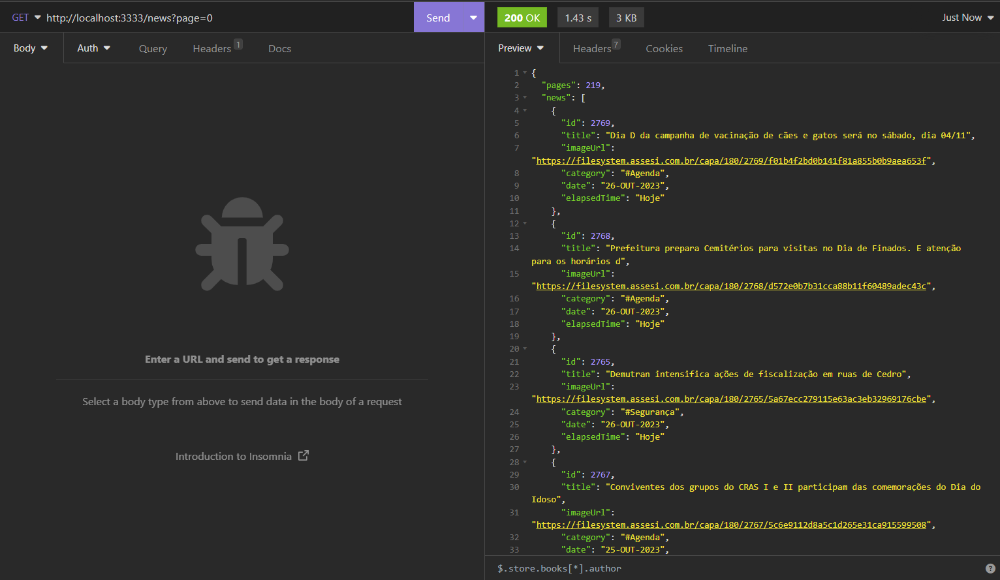

<h1 align="center">Cedro News API</h1>
<p align="center">
  
</p>

<p align="center">
  
</p>

Projeto criado com o intuito de brincar um pouco com [web scraping](https://en.wikipedia.org/wiki/Web_scraping) no TypeScript. Essa API não tem como objetivo ser de grande utilidade, apenas foi um caminho que encontrei para fazer algo mais "prático" e minimamente desafiador do que apenas testar com algum site aleatório.

A API tem como objetivo extrair informações relevantes da página de notícias do [site da prefeitura de Cedro-CE](https://cedro.ce.gov.br/informa.php), cidade onde eu moro. Para fins de teste, fiz o deploy da API no Render, onde você pode conferir [aqui](https://cedro-news-api.onrender.com/news?page=0) (o servidor pode demorar alguns minutos para responder na primeira solicitação, devido à política do Render em relação ao plano free).
- **Curiosidade**: Por conta da estrutura de HTML semelhante, alguns outros sites **ce.gov.br** também funcionam com esse web scraping, bastando apenas mudar a URL do site.

## :hammer_and_wrench: Principais tecnologias e bibliotecas utilizadas

- [NodeJS](https://nodejs.org/en) e [Express](https://expressjs.com);
- [Cheerio](https://github.com/cheeriojs/cheerio): HTML parsing/web scraping;
- [Axios](https://github.com/axios/axios): HTTP requests.

## :memo: API Docs

### Obter todas as notícias

> GET /news?page=0

- **Response - 200 OK:**

```json
{
  "pages": 218,
  "news": [
    {
      "id": 1,
      "title": "Título da notícia",
      "imageUrl": "https://...",
      "category": "#Categoria",
      "date": "26-OUT-2021",
      "elapsedTime": "Há 3 dias"
    },
    [...]
}
```

- **pages** representa o número total de páginas disponíveis para paginação. 12 notícias são retornadas por página.

- **Possíveis erros caso a página informada não contenha notícias ou seja inválida:**

```json
{
  "error": "Não há notícias para a página informada"
}
```

```json
{
  "error": "Número de página inválido"
}
```

### Obter notícia por ID

> GET /news/:id

- **Response - 200 OK:**

```json
{
  "id": 1,
  "title": "Título da notícia",
  "subtitle": "Subtítutlo",
  "imageUrl": "https://...",
  "content": "Conteúdo/texto da notícia",
  "date": "25 DE OUTUBRO DE 2022"
}
```

- Em algumas notícias, **subtitle** e **imageUrl** podem não existir e serão retornados vazios (não nulos).
- **Possíveis erros caso o id informado não contenha uma notícia ou seja inválido:**

```json
{
  "error": "Nenhuma notícia encontrada com o id informado"
}
```

```json
{
  "error": "Id de notícia inválido"
}
```
